# SiCooperative

## Visão Geral
O **SiCooperative** é um sistema para gestão de cooperativas, focado no processamento de transações financeiras. O projeto inclui scripts de extração, transformação e carga de dados (**ETL**), utilizando arquivos **CSV** e integração com um banco de dados SQL.

Utilizei o banco de dados MySQL para modelar os dados, linguagem python para programação e orquestação com Airflow, gerei dados fake com uma volumetria consideravel, e o metodo de ETL inclui o processamento DELTA (Considerando INSERT, UPDATE e não DELETE por se tratar de uma aplicação financeira), o arquivo esta sendo gerado na pasta output mas pode ser alterado no Airflow no menu , mas via Airflow em variaveis isto pode ser alterado.

# Observação

Não utilizei Spark ou PySpark pois iria demandar mais containers de docker, e considere também que as análises mostradas nos screenshots não estão contempladas no Briefer, mas disponibilizei a platarmos porque achei interessante, ainda mais por se tratar de open source e não gerar custos.

... mas na pasta notebooks/with_spark desenvolvi os .py utilizando o PySpark.

## Estrutura do Projeto

```
SiCooperative/
│-- dags/                  # DAGs do Apache Airflow para ETL
│   ├── data/              # Arquivos CSV de entrada
│   ├── output/            # Arquivos gerados como saída do processo ETL
│   ├── scripts/           # Scripts Python para processamento de dados
│   ├── sql/               # Scripts SQL para criação e inserção no banco de dados
│-- notebooks/             # Jupyter Notebooks para análise de dados
│-- logs/                  # Registros de execução das DAGs e scripts
│-- backups/               # Scripts de backup para tabelas do banco
│-- screenshots/           # Capturas de tela do funcionamento do sistema
│-- docker-compose.yml     # Arquivo de configuração para Docker
│-- mysql.sh               # Script para inicialização do banco de dados MySQL
│-- run.sh | run.bat       # Scripts para iniciar o sistema em Linux/Windows
│-- stop.sh | stop.bat     # Scripts para interromper o sistema
│-- .gitignore             # Arquivo de configuração do Git
│-- docs/                  # Documentação do projeto
```

## Requisitos
- **Docker e Docker Compose** (caso deseje rodar o banco via container)

## Instalação e Configuração
### 1. Clonando o Repositório
```bash
git clone https://github.com/seu-usuario/SiCooperative.git
cd SiCooperative
```

### 2. Executando o Sistema
Para iniciar o processamento de dados:
```bash
./run.sh   # No Windows: run.bat
```

## Uso
O sistema utiliza **Airflow** para orquestrar processos ETL. Para acessar a interface Web do Airflow:
```bash
airflow webserver --port 8080
```
Acesse no navegador: `http://localhost:8080` e ative as DAGs disponíveis.

Usuário: admin
Senha: admin

## Bonus
Instalei uma suite para analise de dados

Acesse no navegador: `http://localhost:3000` e configre.

## Algumas capturas de telas realizadas

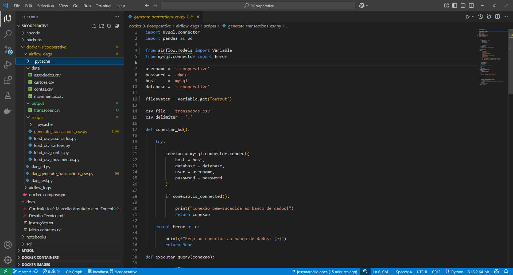

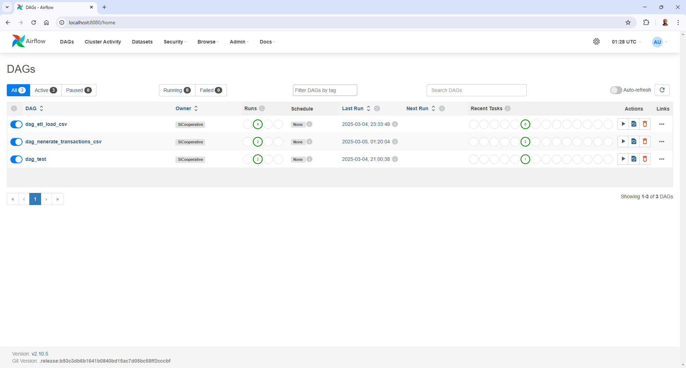

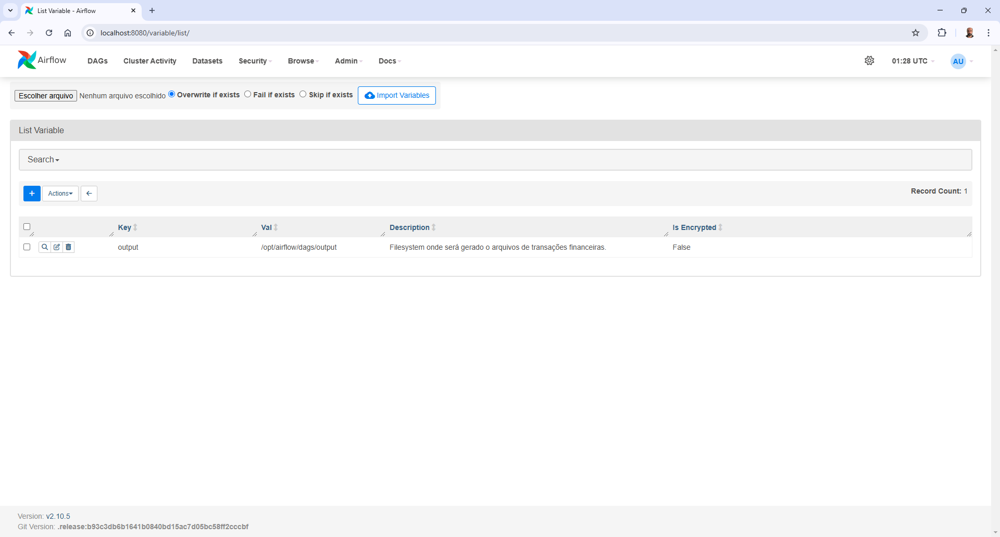

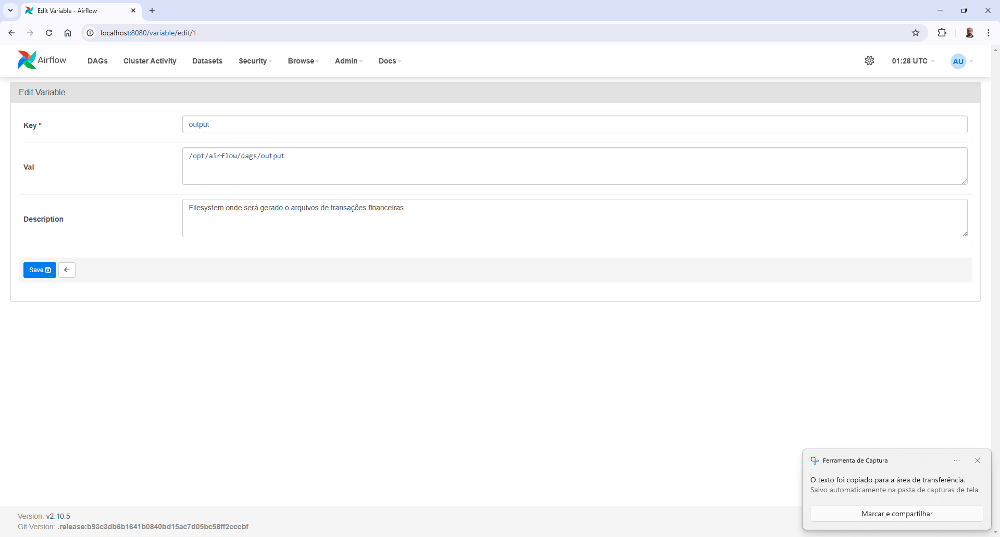

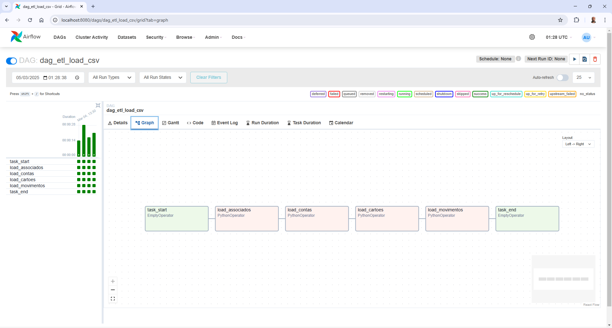

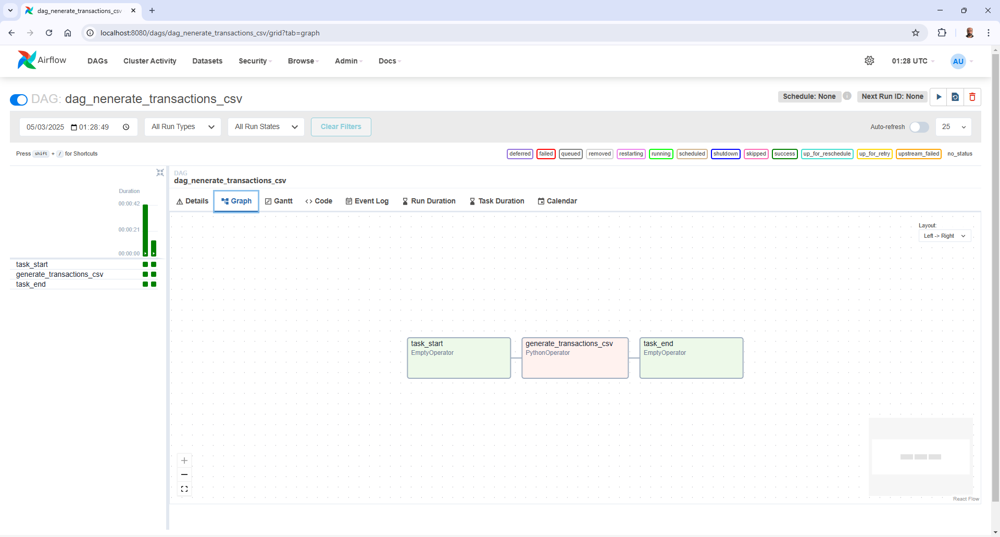

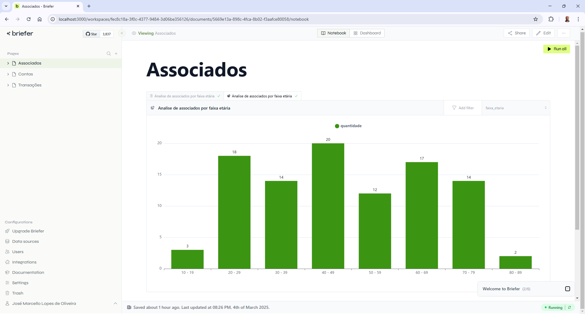

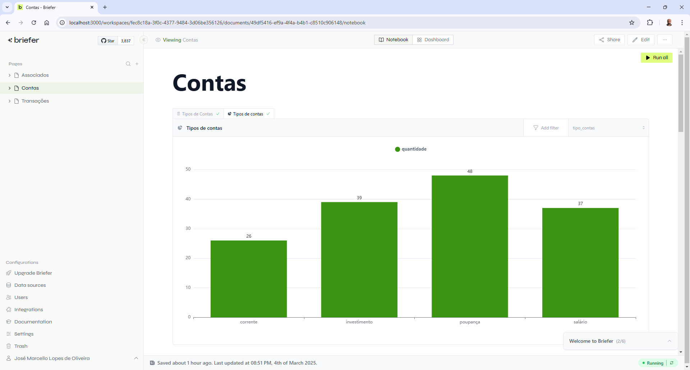

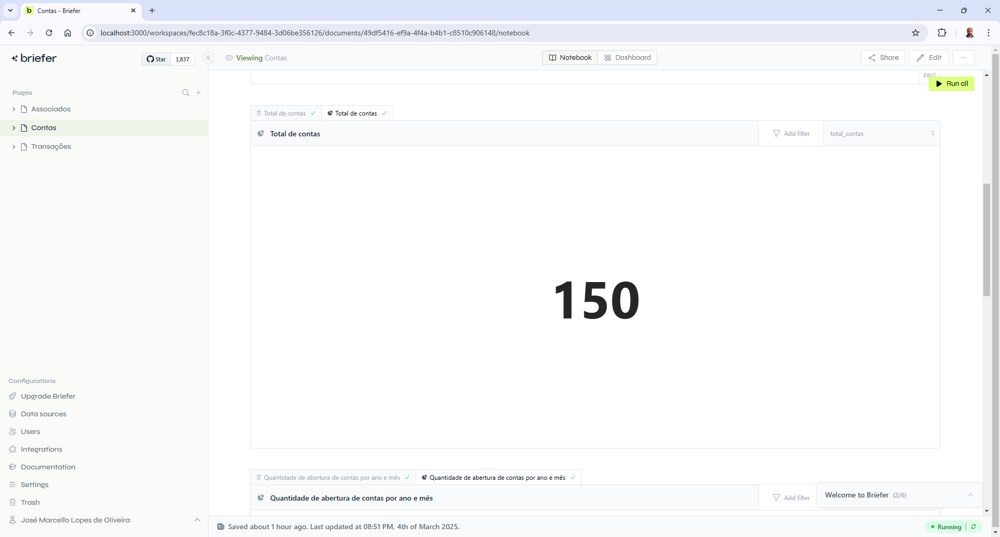

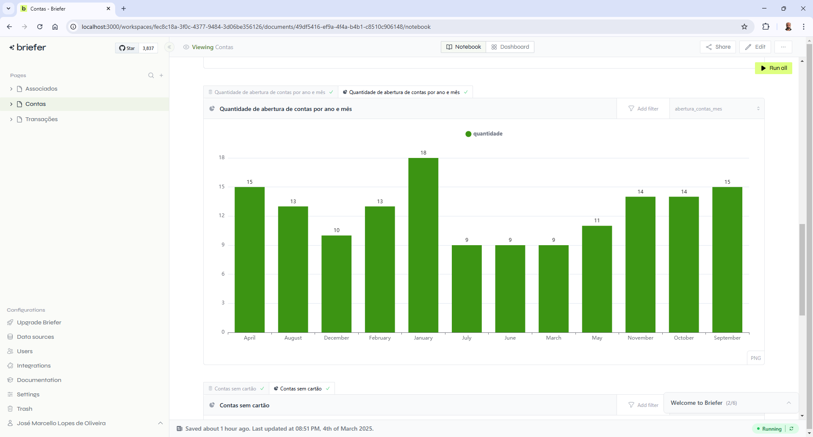

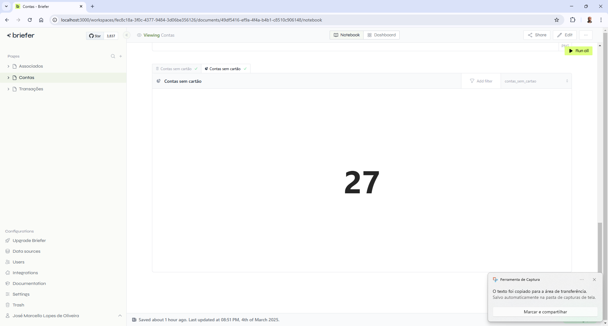

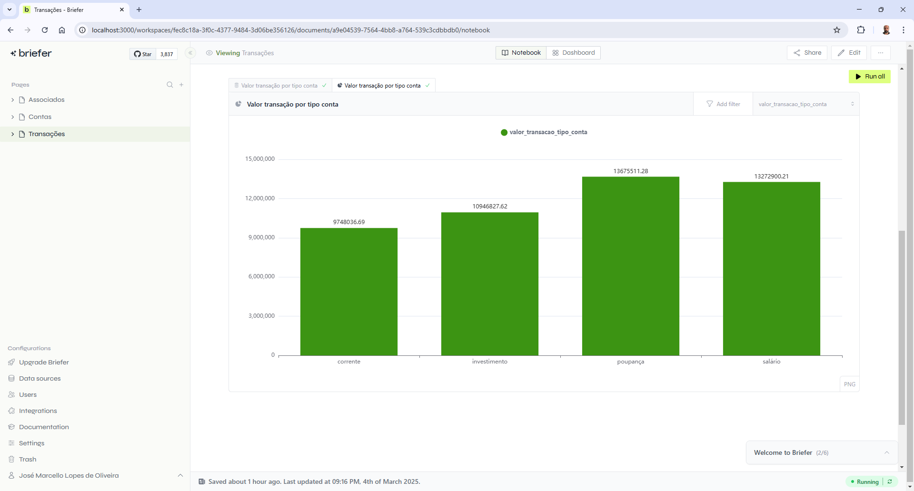

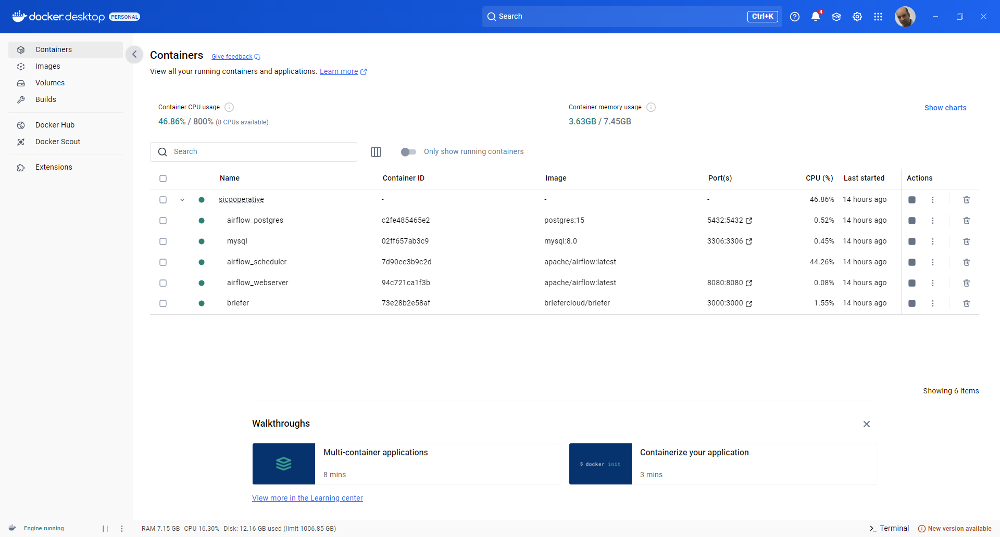

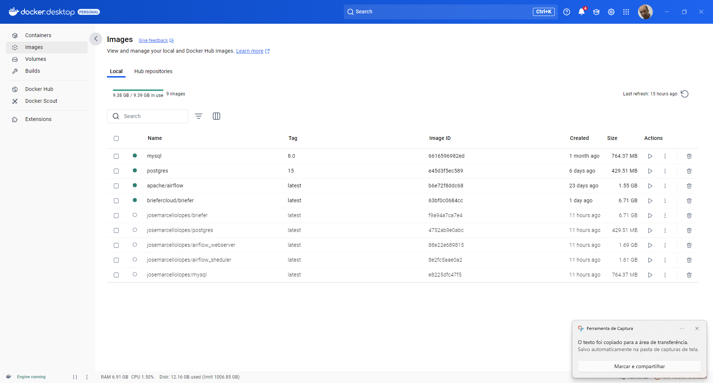

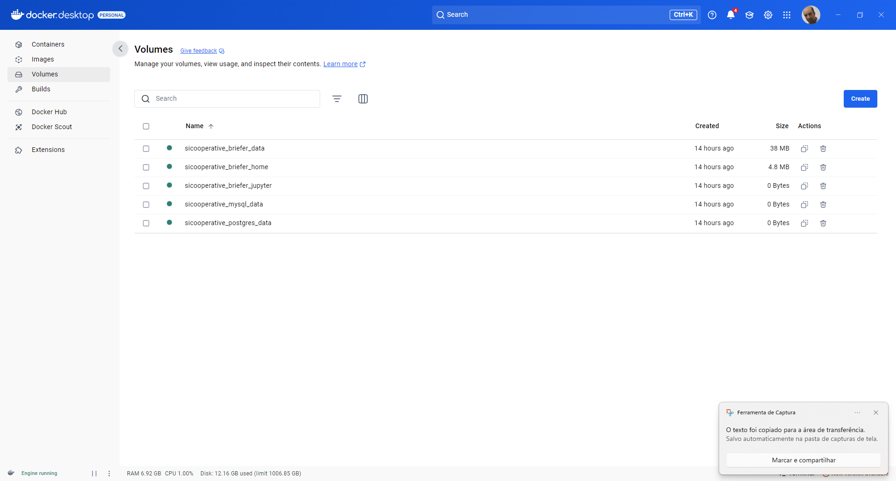


## Contato
Caso tenha dúvidas ou sugestões, entre em contato através dos arquivos disponíveis na pasta `docs/`. 

